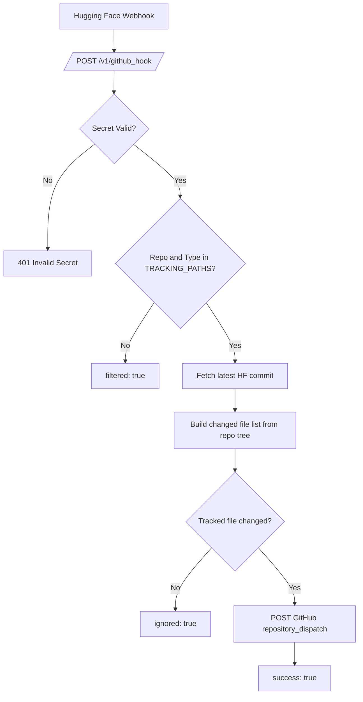

# Hugging Face Webhook Relay

Utility relay service to bridge Hugging Face webhook events into GitHub Actions using `repository_dispatch`.

This project is useful when Hugging Face does not natively support the workflow trigger you need.

## Why This Exists

Hugging Face repositories can emit webhook events, but many delivery patterns (for example directly triggering your GitHub CI/CD workflow with custom filtering) require an intermediate service.

This relay does that job:

1. Receive webhook call from Hugging Face.
2. Validate request with a shared secret.
3. Filter by tracked HF repositories and files.
4. Trigger a target GitHub Action through `repository_dispatch`.

## Architecture

See full architecture details and diagrams in `docs/ARCHITECTURE.md`.

### Request Flow (Mermaid)



## Repository Layout

```text
.
|-- app/
|   |-- app.py             # FastAPI webhook relay endpoint
|   |-- watch_list.py      # Static tracked repo/file configuration
|   |-- Dockerfile         # Runtime image for HF Space
|   `-- requirements.txt   # Runtime dependencies
|-- .github/workflows/
|   `-- pipeline.yml       # Deploy app folder to HF Space
|-- deploy-app.py          # HF Space bootstrap + secret injection + upload
`-- util.py                # Shared helper functions for deploy scripts
```

## Runtime Endpoint

- `GET /`: liveness probe.
- `POST /v1/github_hook`: relay endpoint.

### Query Parameters

- `hf_repo`: Hugging Face repo id (`user/repo`).
- `gh_repo`: GitHub repo id (`owner/repo`).
- `hf_repo_type`: one of `dataset`, `model`, `space`.

### Headers

- `x_webhook_secret`: must match `HF_WEBHOOK_SECRET`.

## Development Setup

### 1) Prerequisites

- Python 3.12+
- A Hugging Face token with required permissions
- A GitHub PAT that can trigger repository dispatch on target repo

### 2) Install dependencies

```bash
python -m venv .venv
# Linux/macOS
source .venv/bin/activate
# Windows (PowerShell)
# .\.venv\Scripts\Activate.ps1

pip install --upgrade pip
pip install -r app/requirements.txt
```

### 3) Set environment variables

```bash
# Required by app runtime
export HF_TOKEN="<hf_token>"
export HF_WEBHOOK_SECRET="<shared_secret>"
export GH_PAT="<github_pat>"

# Required by deploy-app.py
export HF_REPO="<hf_user>/<space_name>"
```

PowerShell example:

```powershell
$env:HF_TOKEN = "<hf_token>"
$env:HF_WEBHOOK_SECRET = "<shared_secret>"
$env:GH_PAT = "<github_pat>"
$env:HF_REPO = "<hf_user>/<space_name>"
```

### 4) Run locally

```bash
uvicorn app.app:app --host 0.0.0.0 --port 7860 --reload
```

## Deployment

### GitHub Actions deploy

Workflow `.github/workflows/pipeline.yml` deploys when files under `app/*` are pushed to `master`.

Required GitHub configuration:

- Secret `HF_WEBHOOK_SECRET`
- Secret `HUGGING_FACE_API_KEY`
- Secret `GH_PAT`
- Variable `HF_REPO`

### Manual deploy

```bash
python deploy-app.py
```

## Tracking Configuration

Tracked paths are configured in `app/watch_list.py`:

```python
TRACKING_PATHS = {
	"user/repo": {
		"dataset": ["file.csv", "folder/file.json"]
	}
}
```

Only configured repositories and file paths can trigger downstream GitHub dispatch.

## Extending Beyond Hugging Face

Current relay logic is Hugging Face specific. To support more providers:

1. Separate request verification and change extraction into source adapters.
2. Keep a normalized internal event model.
3. Reuse a common GitHub dispatch sender.

Suggested interface:

```python
class WebhookSourceAdapter:
	def verify(self, headers: dict, body: bytes) -> bool: ...
	def extract_event(self, request) -> dict: ...
	def changed_files(self, event: dict) -> list[str]: ...
```

## Security Notes

Current implementation is functional but minimal. For production hardening:

1. Add payload signature validation (HMAC) in addition to shared secret.
2. Add replay protection (timestamp and nonce cache).
3. Add rate limiting and request timeouts.
4. Use structured logging and avoid sensitive values in logs.

## Troubleshooting

- `401 Invalid Secret`: verify webhook secret and `x_webhook_secret` header.
- `{"filtered": true}`: `hf_repo` or `hf_repo_type` is not whitelisted in `TRACKING_PATHS`.
- `{"ignored": true}`: event did not modify tracked files.
- GitHub workflow not starting: verify `gh_repo`, PAT permissions, and workflow `repository_dispatch` handler.

## License

Add a license file if this repository is intended for public reuse.
