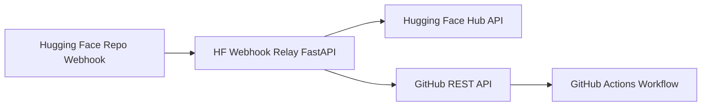
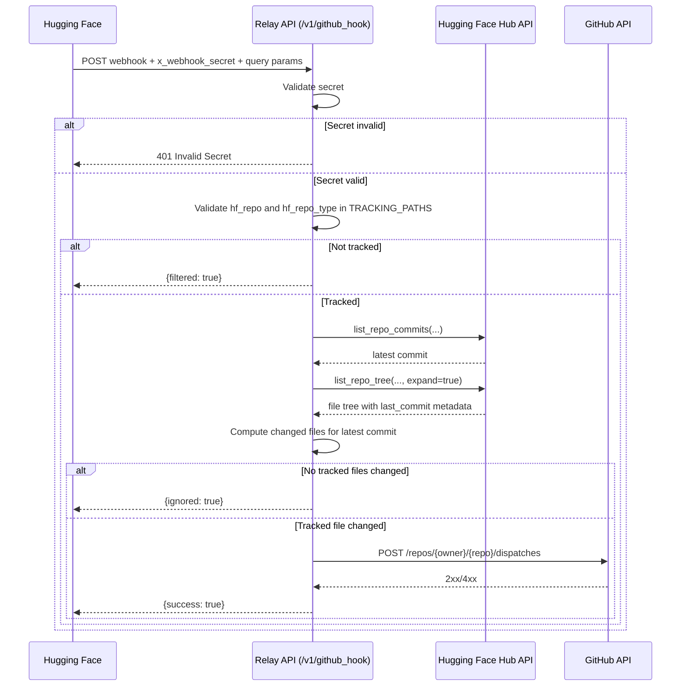

# Architecture

## Overview

This project is a lightweight relay between Hugging Face webhook events and GitHub Actions.

The service:

1. Authenticates the incoming webhook using a shared secret.
2. Checks whether the source HF repo/repo type is allowed.
3. Detects whether tracked files changed on the latest commit.
4. Sends a `repository_dispatch` event to a configured GitHub repository.

## System Context

## Request Sequence

## Component Responsibilities

- `app/app.py`: FastAPI entrypoint and relay control flow.
- `app/watch_list.py`: static whitelist of tracked repositories and file paths.
- `deploy-app.py`: Hugging Face Space bootstrap, secret injection, and app upload.
- `.github/workflows/pipeline.yml`: CI/CD deployment trigger and execution.
- `app/Dockerfile`: runtime image constraints used in Hugging Face Space.

## Runtime Inputs

- `HF_WEBHOOK_SECRET`: shared secret for inbound request gate.
- `HF_TOKEN`: token used to query HF repository metadata.
- `GH_PAT`: token used for GitHub dispatch API.

## Current Constraints

- Source logic is tightly coupled to Hugging Face APIs.
- Tracking config is static in code (`app/watch_list.py`).
- No built-in retry/rate-limit/replay-defense layer.

## Extension Direction

To support additional webhook providers where Hugging Face is not involved:

1. Add source adapters (`verify`, `extract_event`, `changed_files`).
2. Normalize provider output into a common relay event model.
3. Keep GitHub dispatch in a dedicated sender service.
4. Replace static watch list with config backend (file/env/store).
